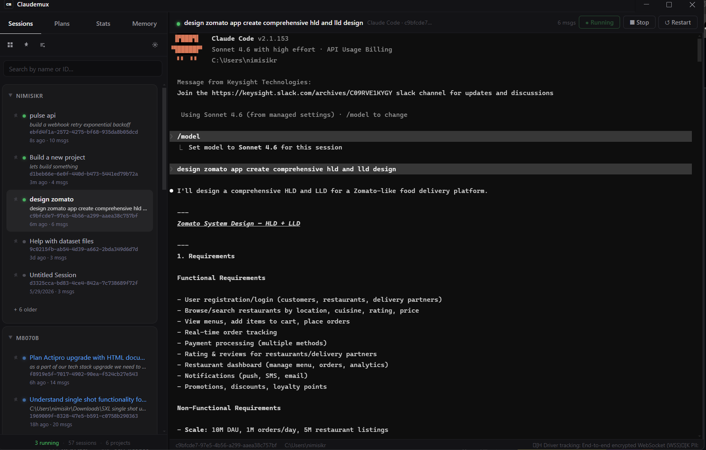
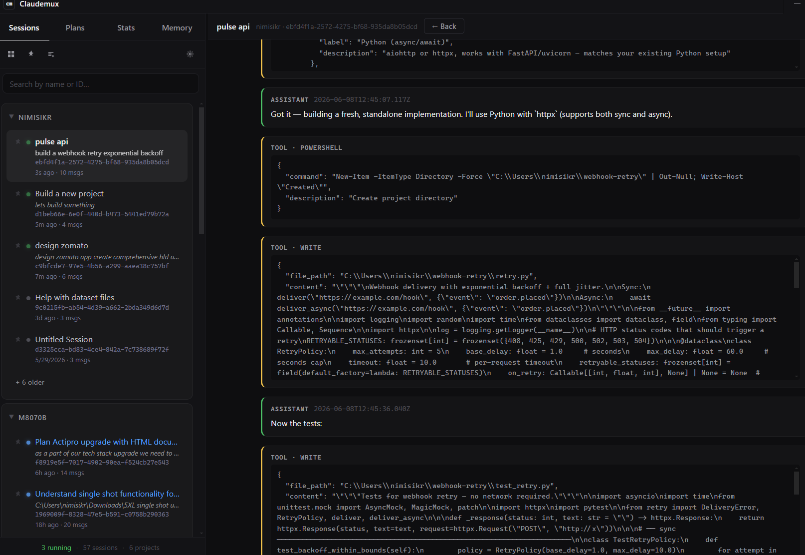
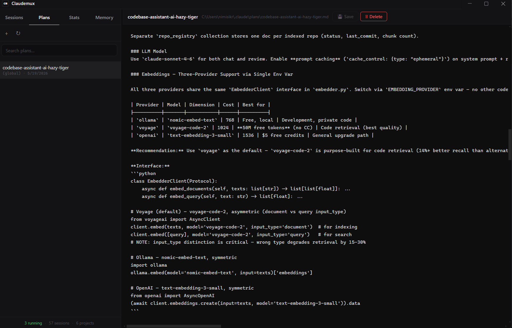

# Claudemux

> tmux for Claude Code sessions — a desktop command center for managing, resuming, and monitoring every Claude Code conversation in one place.



Claudemux scans `~/.claude/projects/` for every session you have ever started with Claude Code, surfaces them grouped by project, and lets you resume, monitor, fork, rename, and tear down sessions from a single window. No more `cd`-ing into a project, copying a UUID out of a folder name, and pasting `claude --resume <uuid>` into a terminal.

---

## Download

**Windows (x64):** grab the latest installer from the [Releases page](https://github.com/nimish-sikri/Claudemux/releases/latest) and run it.

> Windows SmartScreen may show "Windows protected your PC" the first time you run the installer — the build is unsigned. Click **More info** → **Run anyway**.

macOS and Linux builds are not yet packaged. You can still run from source — see [Development](#development).

---

## What it does

- **Session browser** — every Claude Code session you've ever opened, grouped by project, searchable by title or session ID, with a `+ N older` control on long projects.
- **One-click resume** — click any session row, it spawns `claude --resume <uuid>` in an embedded terminal. No tab juggling.
- **Status awareness** — sessions transition to `needs-input` (blue pulse, "NEEDS YOU" badge, optional OS notification) when claude has finished a turn and is waiting on you.
- **Auto-rename pickup** — uses Claude's `/rename` slash-command title automatically; you can also double-click any session title to override the name locally.
- **Plans tab** — lists every `.claude/plans/*.md` file across your projects with an inline editor.
- **Memory tab** — read and edit `~/.claude/CLAUDE.md` (global) plus every project-level `CLAUDE.md`, all in one place.
- **Stats tab** — GitHub-style 26-week activity heatmap + per-project session counts.
- **Grid overview** — bird's-eye view of every active session with live terminal snapshots, refreshed every second.
- **JSONL viewer** — open a clean read-only view of the full conversation transcript for any session, formatted into user / assistant / tool bubbles.
- **Inline file panel** — when claude opens a file, view it side-by-side with the terminal, with a quick toggle between source / inline diff / side-by-side diff.
- **Keyboard shortcuts** — `Ctrl+1..4` switch tabs, `Ctrl+N` new session, `Ctrl+F` find in terminal, `Ctrl+,` settings, `↑/↓` navigate sessions, `Enter` open.
- **Pinned sessions** — star sessions you keep coming back to; filter the sidebar to pinned-only.
- **Right-click context menu** — Open, Rename, Pin/Unpin, View messages, Reveal in Explorer, Stop, Delete.
- **Light + dark theme** — switch from the toolbar; terminal stays dark in both (claude's ANSI output expects a dark palette).
- **Sleek scrollbars, sidebar resize, persistent layout** — all the small things you would expect from a serious desktop tool.

---

---

## Screenshots

**Live terminal with tool-call rendering** — claude's `Write`, `PowerShell`, `Edit`, and subagent calls render as labelled, collapsible cards so you can scan a long conversation quickly.



**Plans editor** — every `.claude/plans/*.md` file across your projects, edited inline in the same window.



---

## How it works

Claudemux talks to your existing Claude Code installation — it does **not** ship its own model or API key. It reads:

- `~/.claude/projects/<encoded-project-path>/<session-id>.jsonl` for session metadata.
- `~/.claude/CLAUDE.md` and per-project `CLAUDE.md` for memory editing.
- `<project>/.claude/plans/*.md` for plans.

When you open a session, Claudemux spawns the `claude` CLI binary via a real PTY ([`node-pty`](https://github.com/microsoft/node-pty)) and renders its output with [xterm.js](https://github.com/xtermjs/xterm.js).

---

## Development

Requirements:

- Node.js 20+
- Windows (other platforms work from source but the installer pipeline is Windows-only right now)
- Claude Code installed and on your PATH (or configured in Settings → Claude binary)

```bash
git clone https://github.com/nimish-sikri/Claudemux.git
cd claudemux
npm install
npm start
```

`npm install` triggers `scripts/postinstall.js` which bundles xterm.js + addons into `public/vendor/`.

### Building the installer

```bash
# Generate the icon files (PNG + ICO)
npm run build:icon

# Build a Windows NSIS installer (output: dist/Claudemux-Setup-*.exe)
npm run build:win
```

Notes on the Windows build:

1. The bundled `node-pty` includes a winpty submodule whose `gyp` invokes batch files via `cd shared && Foo.bat`. On modern Windows that fails because `.` isn't in the cmd PATH. Two lines in `node_modules/node-pty/deps/winpty/src/winpty.gyp` need `.\` prefixes — this is patched manually in this repo's tree but will need to be reapplied after any `npm install` that wipes node_modules. (Eventually we'll script this.)
2. Electron-builder downloads a code-signing toolchain that contains macOS symlinks. Extracting those requires either **Windows Developer Mode** or an **elevated shell**. Run the build from an Administrator PowerShell once, or enable Developer Mode in *Settings → For developers*.

---

## Project layout

```
claudemux/
├── main.js              ← Electron main process; PTY spawning, session scanning, IPC
├── preload.js           ← contextBridge — exposes window.api to the renderer
├── db.js                ← optional SQLite cache (graceful fallback if native module missing)
├── public/
│   ├── index.html       ← single-page app shell
│   ├── styles.css       ← theme variables + all layout
│   ├── app.js           ← renderer — UI, IPC client, xterm wiring
│   └── vendor/          ← xterm.js + addons (generated by postinstall)
├── scripts/
│   ├── postinstall.js   ← copies xterm vendor files into public/vendor/
│   └── make-icon.js     ← procedurally generates the app icon (PNG + ICO)
├── build/               ← icon.png + icon.ico (committed)
└── dist/                ← installer output (gitignored)
```

---

## Roadmap

- Session forking from any point in the transcript
- Git worktree grouping (nested under parent project)
- Scheduled / cron sessions
- Slash-command discovery from `~/.claude/commands/`
- Code-signing certificate (so SmartScreen stops nagging users)
- macOS DMG + Linux AppImage builds

---

## License

MIT — see [LICENSE](LICENSE).
